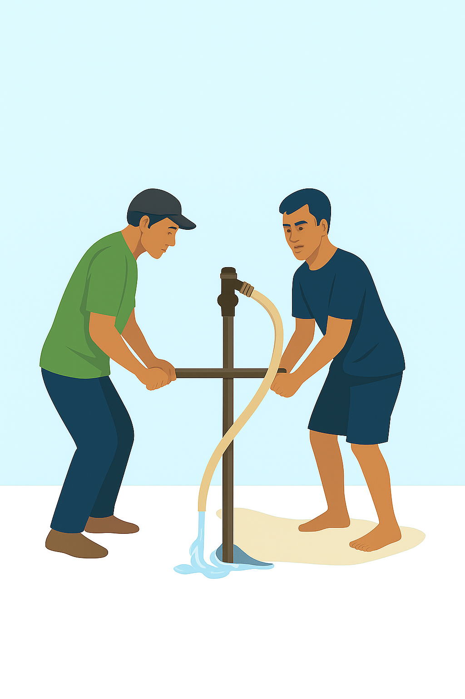

<html lang="id">
<head>
  <meta charset="UTF-8">
  <meta name="viewport" content="width=device-width, initial-scale=1">
  <title>Jasa Bor Sumur Manual</title>
  <link href="https://fonts.googleapis.com/css2?family=Poppins:wght@400;600&display=swap" rel="stylesheet">
  
</head>
<body>

  <header>
    <h1>Jasa Bor Sumur Manual</h1>
    
Air Bersih & Jernih untuk Rumah Anda

  </header>

  

    

    <ul class="features">
      <li>✔️ Harga Terjangkau</li>
      <li>✔️ Pengerjaan Cepat & Rapi</li>
      <li>✔️ Cocok untuk Sumur Dangkal</li>
    </ul>

    

      
<strong>Melayani:</strong> Musi Rawas dan Lubuk Linggau

    

    

      
Hubungi: 0851-7532-9877

    

    

      <h2>Apa Itu Bor Sumur Manual?</h2>
      
Bor sumur manual adalah metode pengeboran sumur dengan alat sederhana dan tenaga manusia tanpa menggunakan mesin berat. Cocok untuk wilayah perumahan atau lokasi sempit yang sulit dijangkau alat berat.

      <h2>Keunggulan Jasa Kami</h2>
      <ul>
        <li>💧 Air dijamin bersih & jernih (bisa langsung digunakan)</li>
        <li>🔧 Tim profesional & berpengalaman</li>
        <li>📍 Pengerjaan bisa di lokasi sempit (gang, samping rumah, dll)</li>
        <li>⏱️ Estimasi waktu pengerjaan 1–3 hari tergantung kondisi tanah</li>
      </ul>

      <h2>Harga dan Paket</h2>
      
Kami menawarkan harga mulai dari <strong>Rp2.000.000</strong> tergantung kedalaman dan lokasi.

      <blockquote>Hubungi kami langsung untuk konsultasi gratis dan survei lokasi!</blockquote>
    

    

      <a href="https://wa.me/6285175329877" target="_blank">💬 Konsultasi via WhatsApp</a>
    

  

  <footer>
    &copy; 2025 Jasa Bor Sumur Manual. Semua Hak Dilindungi.
  </footer>

</body>
</html>
